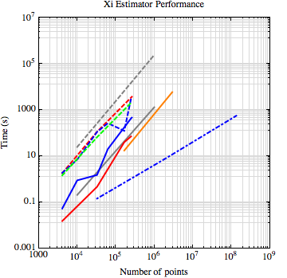

turbo-octo-spice 
================

Efficient mock generation and analysis of Lyman-alpha forest surveys

Motivation
----------

The BOSS quasar sample contains ~100k quasar spectra. Individual spectra sample the Lyman-alpha forest along the line of sight to the quasar. There are typically about ~100 pixels in that contain information about the Lyman-alpha forest density field in each spectrum.

The plot below shows a comparison for generating and analyzing a gaussian random field on a cubic grid. Each line color corresponds to a different system the benchmark was performed on. Blue corresponds to my laptop, red corresponds to UCI HPC public GPU server, green corresponds to our group server 'darkmatter', and gray corresponds to Table 1 of "Cosmological calculations on the GPU" (Bard et al., 2012). The solid lines indicate a "brute force" GPU implementation xi estimator while the dashed lines indicate a "brute force" CPU implementation xi estimator. The dot-dashed line indicates the gaussian random field generation performance of 'cosmogrf'.

Dependencies
------------

 * boost (from source)
 * likely
  * gsl (from source)
  * Minuit2 (from source)
 * cosmo
  * fftw (from source)
 * libhdf5 (`sudo apt-get install libhdf5-dev`)
 * cfitso 
 * ccfits (`sudo apt-get install libccfits-dev`)
 * healpix (from source, generic-gcc)

